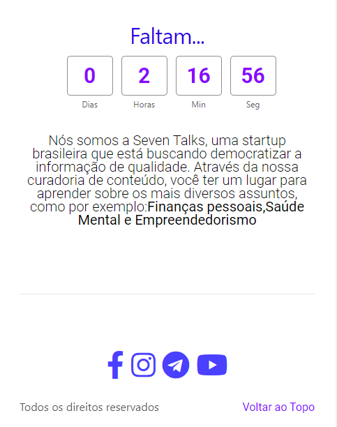

# GamaXP-SevenTalks
Repositório destinado ao projeto realizado durante a Gama XP 35.

Link: https://seventalks.com.br

 Projeto realizado de 23/08 a 28/08 para a criação de uma Landing Page de divulgação para um evento ao vivo no youtube com dois dias de duração. 
 

 Foi realizado o design da página de acordo com o proposto, além  do desenvolvimento de uma contagem regressiva e de um exit pop-up 
 
<h1>Versão da página <i>Seventalks</i> para desktop<h1>

  
<h1>Versão da página <i>Seventalks</i> para mobile<h1>

